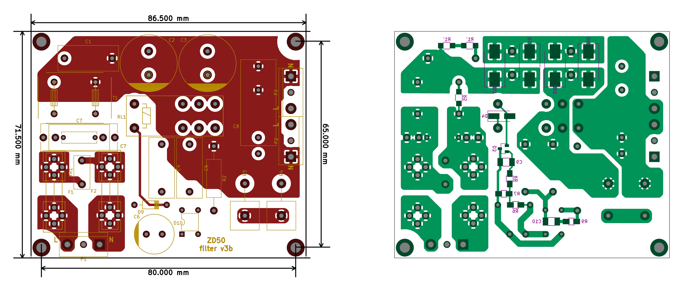

## Softstart for ZD-50

### Description
Simple softstart system for amplifier LM3886 ZD-50. This device can be used with any amplifiers / power supply, that used a big batterys of capacitors

### Links
- in progress...

### Authors
- Shematic, pcb design - [Mellowman](http://forum.vegalab.ru/member.php?u=17319)

### Buy parts for assembling
- [Order PCB from PCBWay](https://www.pcbway.com/project/shareproject/softstart_zd_50.html)

### Related projects
- [Amplifier LM3886 ZD-50](https://github.com/diyaudioby/amp-lm3886-zd-50)
- [Power supply for LM3886 ZD-50](https://github.com/diyaudioby/ps-zd-50)

### Folder structure
Most folder names are self explanatory.
- 3d - contains 3d models of PCB
- bom - contains the bill of materials
- docs - contains drawings and images outputs of schematic and PCB files, assembling manuals
- firmware - contains compiled binary files
- gerbers - contains zip file of the PCB Gerbers and drill drawings for manufacture
- images - contain photo of assembling prototype
- pcb - contains the original schematic and PCB design files (Altium Designer,  KiCAD, SprintLayout, etc)
- soft - contains custom software using, for example, for operate with this device 
- source - contains project souce code (sketchs for Arduino, files C/C++, etc)
- transformers - contains spec for transformers, coils, etc